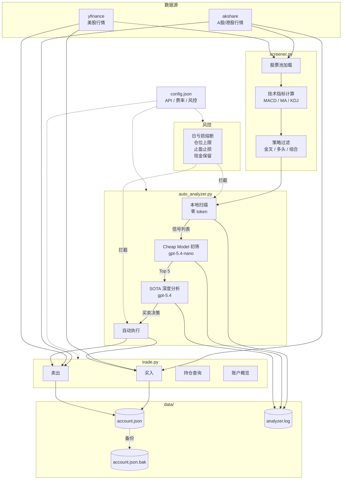

# Stock Trader

A股/港股/美股技术指标选股 + LLM 分析 + 模拟交易系统。

## 架构



## 快速开始

### 依赖

```bash
pip install akshare yfinance openai
```

### 配置 API Key

```bash
export STOCK_TRADER_API_KEY="your-api-key"
```

或填入 `config.json` 的 `api.api_key` 字段（不推荐）。

### 选股扫描

```bash
python3 scripts/screener.py --strategy macd          # A股 MACD 金叉
python3 scripts/screener.py --strategy combined       # MACD + 均线多头
python3 scripts/screener.py --market hk --strategy ma # 港股均线
python3 scripts/screener.py --market us --strategy kdj # 美股 KDJ
```

策略说明：
- `macd` — MACD 金叉（近3天 DIF 上穿 DEA）
- `ma` — 均线多头（收盘价站上 MA5 且 MA5 > MA10）
- `kdj` — KDJ 金叉（近3天 K 上穿 D，J < 90）
- `combined` — MACD 金叉 + 均线多头

### 模拟交易

```bash
python3 scripts/trade.py buy --code 600519 --shares 100
python3 scripts/trade.py sell --code AAPL --shares 5
python3 scripts/trade.py portfolio    # 持仓
python3 scripts/trade.py account      # 账户概览
python3 scripts/trade.py history      # 交易记录
```

### 自动分析

```bash
python3 scripts/auto_analyzer.py
```

三层漏斗自动运行：本地技术指标扫描（零 token）→ Cheap Model 初筛 → SOTA 逐只深度分析 → 自动买卖执行。

## 在 OpenClaw 中使用

### 安装

Skill 目录位于 `~/.openclaw/workspace/skills/stock-trader/`，OpenClaw 启动时自动扫描 `skills/` 目录并加载 `SKILL.md`，无需额外注册。

### 自然语言触发

OpenClaw agent 根据 `SKILL.md` 中的指令映射表自动匹配：

| 你说的话 | 执行的命令 |
|---------|-----------|
| "选股" / "扫描" | `screener.py --strategy combined` |
| "选股 macd" / "选股 kdj" / "选股 均线" | 对应策略 |
| "港股选股" | `screener.py --market hk` |
| "美股选股" | `screener.py --market us` |
| "买入 600519 100股" | `trade.py buy --code 600519 --shares 100` |
| "买入 AAPL 10股" | `trade.py buy --code AAPL --shares 10` |
| "持仓" / "仓位" | `trade.py portfolio` |
| "账户" / "资金" | `trade.py account` |
| "交易记录" | `trade.py history` |

`SKILL.md` 中的 `{baseDir}` 会被自动替换为 skill 实际路径。

### 自动分析定时任务

`auto_analyzer.py` 可配合 OpenClaw 的 cron 在交易时段自动运行三层漏斗：

```
本地技术指标扫描（零 token）→ Cheap Model 初筛 → SOTA 深度分析 → 自动买卖
```

### 跨 Agent 协作

支持多 agent 协调：后台 agent 定时跑 `auto_analyzer.py`，用 `agent-watch` skill 监控执行状态，主会话随时查询持仓和交易结果。

## 风控

| 参数 | 默认值 | 说明 |
|------|--------|------|
| max_position_pct | 20% | 单只最大仓位占比 |
| max_daily_loss_pct | 5% | 日亏损熔断线 |
| stop_loss_pct | 3% | 持仓跌幅触发止损分析 |
| take_profit_pct | 3% | 持仓涨幅触发止盈分析 |
| min_cash_reserve | 5000 | 最低现金保留 |

## 费率

在 `config.json` 的 `fees` 字段配置：
- `commission`: 佣金费率（默认万三）
- `stamp_tax`: 印花税率（默认千一，仅卖出）
