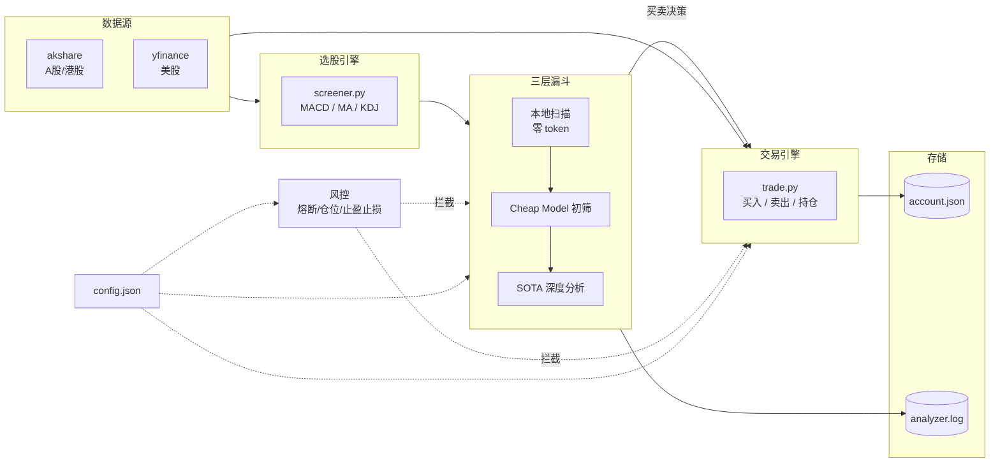

# Stock Trader

A股/港股/美股技术指标选股 + LLM 智能分析 + 模拟交易系统。

覆盖从数据获取、技术指标计算、AI 多层筛选到自动下单的完整交易链路，支持通过 [OpenClaw](https://github.com/openclaw) 自然语言驱动和定时自动化。

## 特性

- 多市场支持 — A股（沪深）、港股、美股，统一接口
- 四种选股策略 — MACD 金叉、均线多头、KDJ 金叉、组合策略
- 三层漏斗分析 — 本地扫描（零 token）→ Cheap Model 初筛 → SOTA 深度分析
- 模拟交易引擎 — 买卖、持仓管理、盈亏统计、交易历史
- 风控体系 — 仓位上限、日亏损熔断、止盈止损、现金保留
- 自动化 — 支持定时任务，交易时段自动扫描 + 分析 + 执行
- OpenClaw 集成 — 自然语言触发，结果推送 Telegram

## 架构



## 快速开始

### 环境要求

- Python 3.9+
- 一个兼容 OpenAI 接口的 API Key（用于 LLM 分析层）

### 安装依赖

```bash
pip install akshare yfinance openai
```

### 配置

复制示例配置并填入你的 API Key：

```bash
cp config.example.json config.json
```

```json
{
  "api": {
    "base_url": "https://api.openai.com/v1",
    "api_key": "your-api-key",
    "cheap_model": "gpt-5.4-nano",       // 或 gemini-3-flash
    "sota_model": "gpt-5.4"              // 或 claude-opus-4-6
  }
}
```

也可以通过环境变量设置（优先级高于 config）：

```bash
export STOCK_TRADER_API_KEY="your-api-key"
```

## 使用

### 选股扫描

```bash
# A股
python3 scripts/screener.py --strategy macd        # MACD 金叉
python3 scripts/screener.py --strategy ma           # 均线多头
python3 scripts/screener.py --strategy kdj          # KDJ 金叉
python3 scripts/screener.py --strategy combined     # MACD + 均线多头

# 港股 / 美股
python3 scripts/screener.py --market hk --strategy macd
python3 scripts/screener.py --market us --strategy kdj

# 调整扫描范围
python3 scripts/screener.py --count 200 --limit 30 --strategy combined
```

**策略说明：**

| 策略 | 触发条件 | 适用场景 |
|------|---------|---------|
| `macd` | 近 3 天 DIF 上穿 DEA | 趋势反转初期 |
| `ma` | 收盘价站上 MA5 且 MA5 > MA10 | 短期多头确认 |
| `kdj` | 近 3 天 K 上穿 D，J < 90 | 超卖反弹 |
| `combined` | MACD 金叉 + 均线多头同时满足 | 高确定性信号 |

### 模拟交易

```bash
# 买入
python3 scripts/trade.py buy --code 600519 --shares 100    # A股（贵州茅台）
python3 scripts/trade.py buy --code AAPL --shares 10       # 美股（苹果）
python3 scripts/trade.py buy --code 00700 --shares 200     # 港股（腾讯）

# 卖出
python3 scripts/trade.py sell --code 600519 --shares 50

# 查询
python3 scripts/trade.py portfolio                          # 当前持仓
python3 scripts/trade.py account                            # 账户概览
python3 scripts/trade.py history                            # 全部交易记录
python3 scripts/trade.py history --code AAPL                # 单只记录
```

### 自动分析（三层漏斗）

```bash
python3 scripts/auto_analyzer.py
```

执行流程：

1. **本地扫描**（零 token） — 对股票池跑技术指标策略，筛出候选信号
2. **Cheap Model 初筛** — 用低成本模型从候选中选出最值得分析的 5 只
3. **SOTA 深度分析** — 用高能力模型逐只分析，给出买入/跳过决策及理由
4. **自动执行** — 对买入决策调用交易引擎下单，全程风控拦截

每一步都有日志记录，输出到 `data/analyzer.log`。

## 风控体系

交易全程受风控模块约束，任何一条触发都会拦截操作：

| 参数 | 默认值 | 说明 |
|------|--------|------|
| `max_position_pct` | 20% | 单只股票最大仓位占总资产比例 |
| `max_daily_loss_pct` | 5% | 当日累计亏损超过此比例触发熔断，停止所有买入 |
| `stop_loss_pct` | 3% | 持仓跌幅超过此值触发止损分析 |
| `take_profit_pct` | 3% | 持仓涨幅超过此值触发止盈分析 |
| `min_cash_reserve` | 5000 | 可用资金低于此值停止买入 |

止盈止损触发后不会直接卖出，而是交给 SOTA 模型分析是否应该卖出/持有，避免机械操作。

## 费率配置

在 `config.json` 的 `fees` 字段自定义：

```json
{
  "fees": {
    "commission": 0.0003,
    "stamp_tax": 0.001
  }
}
```

- `commission` — 佣金费率（默认万三，买卖双向收取）
- `stamp_tax` — 印花税率（默认千一，仅卖出时收取）

## 在 OpenClaw 中使用

### 安装

将 skill 目录放到 `~/.openclaw/workspace/skills/stock-trader/`，OpenClaw 启动时自动扫描加载，无需额外注册。

### 自然语言驱动

直接用中文对话即可触发所有功能：

| 你说的话 | 执行的操作 |
|---------|-----------|
| "选股" / "扫描" | 运行 combined 策略扫描 A 股 |
| "选股 macd" / "选股 kdj" / "选股 均线" | 运行对应策略 |
| "港股选股" / "美股选股" | 切换市场扫描 |
| "买入 600519 100股" | 模拟买入 A 股 |
| "买入 AAPL 10股" | 模拟买入美股 |
| "卖出 00700 200股" | 模拟卖出港股 |
| "持仓" / "仓位" | 查看当前持仓和盈亏 |
| "账户" / "资金" | 查看账户总览 |
| "交易记录" | 查看历史交易 |

### 定时自动化

配合 OpenClaw cron 系统，可在交易时段自动运行分析：

```json
{
  "schedule": { "expr": "30 9,10,11,13,14 * * 1-5", "tz": "Asia/Shanghai" },
  "delivery": { "channel": "telegram" }
}
```

工作日 9:30 ~ 14:30 每小时自动执行三层漏斗，结果推送到 Telegram。

### 跨 Agent 协作

支持 OpenClaw 多 agent 协调模式：
- 后台 agent 定时运行 `auto_analyzer.py`
- `agent-watch` skill 监控执行状态和进度
- 主会话随时查询持仓、交易结果

## 项目结构

```
stock-trader/
├── scripts/
│   ├── screener.py        # 选股扫描（技术指标策略）
│   ├── auto_analyzer.py   # 三层漏斗自动分析系统
│   └── trade.py           # 模拟交易引擎
├── data/
│   ├── account.json       # 账户数据（持仓/资金/历史）
│   ├── account.json.bak   # 自动备份
│   └── analyzer.log       # 分析日志（按天轮转）
├── config.json            # 运行配置（API/费率/风控/扫描）
├── SKILL.md               # OpenClaw skill 定义
└── _meta.json             # 元数据
```

## License

MIT
